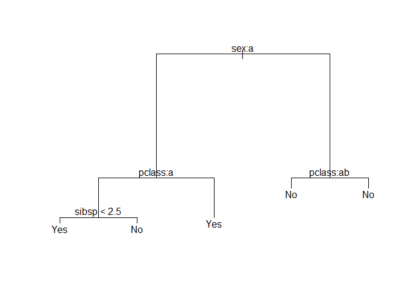
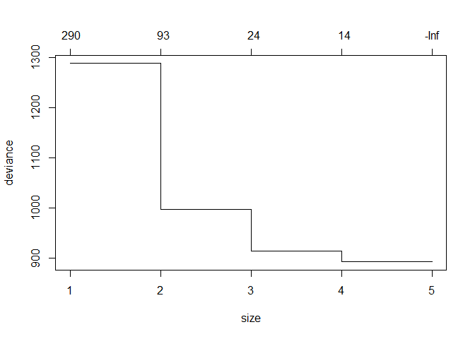

Decision Tree
================

``` r
path <-
'https://raw.githubusercontent.com/guru99-edu/R-Programming/master/titanic_data.csv'
```

``` r
titanic <-read.csv(path)
```

``` r
str(titanic)
```

    ## 'data.frame':    1309 obs. of  13 variables:
    ##  $ x        : int  1 2 3 4 5 6 7 8 9 10 ...
    ##  $ pclass   : int  1 1 1 1 1 1 1 1 1 1 ...
    ##  $ survived : int  1 1 0 0 0 1 1 0 1 0 ...
    ##  $ name     : Factor w/ 1307 levels "Abbing, Mr. Anthony",..: 22 24 25 26 27 31 46 47 51 55 ...
    ##  $ sex      : Factor w/ 2 levels "female","male": 1 2 1 2 1 2 1 2 1 2 ...
    ##  $ age      : Factor w/ 99 levels "?","0.1667","0.3333",..: 39 8 23 41 33 67 86 55 73 94 ...
    ##  $ sibsp    : int  0 1 1 1 1 0 1 0 2 0 ...
    ##  $ parch    : int  0 2 2 2 2 0 0 0 0 0 ...
    ##  $ ticket   : Factor w/ 929 levels "110152","110413",..: 188 50 50 50 50 125 93 16 77 826 ...
    ##  $ fare     : Factor w/ 282 levels "?","0","10.1708",..: 79 58 58 58 58 103 236 2 157 153 ...
    ##  $ cabin    : Factor w/ 187 levels "?","A10","A11",..: 45 81 81 81 81 151 147 17 63 1 ...
    ##  $ embarked : Factor w/ 4 levels "?","C","Q","S": 4 4 4 4 4 4 4 4 4 2 ...
    ##  $ home.dest: Factor w/ 370 levels "?","?Havana, Cuba",..: 310 232 232 232 232 238 163 25 23 230 ...

``` r
titanic <- titanic[, -c(1,4,9,11,13)]
```

``` r
titanic$pclass[titanic$pclass==1]="Upper"
titanic$pclass[titanic$pclass==2]="Middle"
titanic$pclass[titanic$pclass==3]="Lower"
```

``` r
titanic$survived[titanic$survived==0]="No"
titanic$survived[titanic$survived==1]="Yes"
```

``` r
titanic$age <- as.numeric(titanic$age)
titanic$fare <- as.numeric(titanic$fare)
str(titanic)
```

    ## 'data.frame':    1309 obs. of  8 variables:
    ##  $ pclass  : chr  "Upper" "Upper" "Upper" "Upper" ...
    ##  $ survived: chr  "Yes" "Yes" "No" "No" ...
    ##  $ sex     : Factor w/ 2 levels "female","male": 1 2 1 2 1 2 1 2 1 2 ...
    ##  $ age     : num  39 8 23 41 33 67 86 55 73 94 ...
    ##  $ sibsp   : int  0 1 1 1 1 0 1 0 2 0 ...
    ##  $ parch   : int  0 2 2 2 2 0 0 0 0 0 ...
    ##  $ fare    : num  79 58 58 58 58 103 236 2 157 153 ...
    ##  $ embarked: Factor w/ 4 levels "?","C","Q","S": 4 4 4 4 4 4 4 4 4 2 ...

``` r
titanic$survived <- as.factor(titanic$survived)
titanic$pclass <- as.factor(titanic$pclass)
str(titanic)
```

    ## 'data.frame':    1309 obs. of  8 variables:
    ##  $ pclass  : Factor w/ 3 levels "Lower","Middle",..: 3 3 3 3 3 3 3 3 3 3 ...
    ##  $ survived: Factor w/ 2 levels "No","Yes": 2 2 1 1 1 2 2 1 2 1 ...
    ##  $ sex     : Factor w/ 2 levels "female","male": 1 2 1 2 1 2 1 2 1 2 ...
    ##  $ age     : num  39 8 23 41 33 67 86 55 73 94 ...
    ##  $ sibsp   : int  0 1 1 1 1 0 1 0 2 0 ...
    ##  $ parch   : int  0 2 2 2 2 0 0 0 0 0 ...
    ##  $ fare    : num  79 58 58 58 58 103 236 2 157 153 ...
    ##  $ embarked: Factor w/ 4 levels "?","C","Q","S": 4 4 4 4 4 4 4 4 4 2 ...

``` r
length(which(titanic$embarked=="?"))
```

    ## [1] 2

``` r
titanic <- titanic[!(titanic$embarked=="?"),]
```

``` r
smp_size <- floor(0.75*nrow(titanic))
set.seed(42)
train_ind <- sample(seq_len(nrow(titanic)), size=smp_size)

train <- titanic[train_ind, ]
test <- titanic[-train_ind, ]
```

``` r
summary(train)
```

    ##     pclass    survived      sex           age            sibsp       
    ##  Lower :545   No :622   female:340   Min.   : 1.00   Min.   :0.0000  
    ##  Middle:190   Yes:358   male  :640   1st Qu.:18.00   1st Qu.:0.0000  
    ##  Upper :245                          Median :33.00   Median :0.0000  
    ##                                      Mean   :34.53   Mean   :0.5092  
    ##                                      3rd Qu.:52.00   3rd Qu.:1.0000  
    ##                                      Max.   :99.00   Max.   :8.0000  
    ##      parch             fare       embarked
    ##  Min.   :0.0000   Min.   :  1.0   ?:  0   
    ##  1st Qu.:0.0000   1st Qu.: 74.0   C:211   
    ##  Median :0.0000   Median :150.0   Q: 97   
    ##  Mean   :0.3745   Mean   :142.6   S:672   
    ##  3rd Qu.:0.0000   3rd Qu.:214.0           
    ##  Max.   :9.0000   Max.   :282.0

``` r
library(tree)
```

    ## Warning: package 'tree' was built under R version 3.6.1

``` r
train.tr <- tree(survived~ . , train)
plot(train.tr)
text(train.tr)
```



``` r
train.tr
```

    ## node), split, n, deviance, yval, (yprob)
    ##       * denotes terminal node
    ## 
    ## 1) root 980 1287.00 No ( 0.6347 0.3653 )  
    ##   2) sex: female 340  400.90 Yes ( 0.2765 0.7235 )  
    ##     4) pclass: Lower 167  231.50 No ( 0.5030 0.4970 )  
    ##       8) sibsp < 2.5 149  205.40 Yes ( 0.4564 0.5436 ) *
    ##       9) sibsp > 2.5 18   12.56 No ( 0.8889 0.1111 ) *
    ##     5) pclass: Middle,Upper 173   76.42 Yes ( 0.0578 0.9422 ) *
    ##   3) sex: male 640  593.60 No ( 0.8250 0.1750 )  
    ##     6) pclass: Lower,Middle 500  393.90 No ( 0.8660 0.1340 ) *
    ##     7) pclass: Upper 140  175.80 No ( 0.6786 0.3214 ) *

``` r
summary(train.tr)
```

    ## 
    ## Classification tree:
    ## tree(formula = survived ~ ., data = train)
    ## Variables actually used in tree construction:
    ## [1] "sex"    "pclass" "sibsp" 
    ## Number of terminal nodes:  5 
    ## Residual mean deviance:  0.8863 = 864.1 / 975 
    ## Misclassification error rate: 0.1959 = 192 / 980

``` r
train.cv = cv.tree(train.tr, FUN=prune.tree)
plot(train.cv)
```



``` r
train.best.5 = prune.tree(train.tr, best=5)
train.best.5
```

    ## node), split, n, deviance, yval, (yprob)
    ##       * denotes terminal node
    ## 
    ## 1) root 980 1287.00 No ( 0.6347 0.3653 )  
    ##   2) sex: female 340  400.90 Yes ( 0.2765 0.7235 )  
    ##     4) pclass: Lower 167  231.50 No ( 0.5030 0.4970 )  
    ##       8) sibsp < 2.5 149  205.40 Yes ( 0.4564 0.5436 ) *
    ##       9) sibsp > 2.5 18   12.56 No ( 0.8889 0.1111 ) *
    ##     5) pclass: Middle,Upper 173   76.42 Yes ( 0.0578 0.9422 ) *
    ##   3) sex: male 640  593.60 No ( 0.8250 0.1750 )  
    ##     6) pclass: Lower,Middle 500  393.90 No ( 0.8660 0.1340 ) *
    ##     7) pclass: Upper 140  175.80 No ( 0.6786 0.3214 ) *

``` r
summary(train.best.5)
```

    ## 
    ## Classification tree:
    ## tree(formula = survived ~ ., data = train)
    ## Variables actually used in tree construction:
    ## [1] "sex"    "pclass" "sibsp" 
    ## Number of terminal nodes:  5 
    ## Residual mean deviance:  0.8863 = 864.1 / 975 
    ## Misclassification error rate: 0.1959 = 192 / 980

``` r
plot(train.best.5)
text(train.best.5)
```


``` r
head(predict(train.best.5, test, type="class"), 20)
```

    ##  [1] No  Yes Yes Yes Yes No  No  Yes Yes No  Yes Yes Yes No  No  No  No 
    ## [18] No  Yes Yes
    ## Levels: No Yes

``` r
ipredict = predict(train.best.5, test, type="class")
table(ipredict, test$survived)
```

    ##         
    ## ipredict  No Yes
    ##      No  156  50
    ##      Yes  31  90

``` r
library(e1071)
```

    ## Warning: package 'e1071' was built under R version 3.6.1

``` r
library(caret)
```

    ## Warning: package 'caret' was built under R version 3.6.1

    ## Loading required package: lattice

    ## Loading required package: ggplot2

    ## Warning: package 'ggplot2' was built under R version 3.6.1

``` r
confusionMatrix(ipredict, test$survived)
```

    ## Confusion Matrix and Statistics
    ## 
    ##           Reference
    ## Prediction  No Yes
    ##        No  156  50
    ##        Yes  31  90
    ##                                           
    ##                Accuracy : 0.7523          
    ##                  95% CI : (0.7018, 0.7981)
    ##     No Information Rate : 0.5719          
    ##     P-Value [Acc > NIR] : 8.059e-12       
    ##                                           
    ##                   Kappa : 0.4854          
    ##                                           
    ##  Mcnemar's Test P-Value : 0.0455          
    ##                                           
    ##             Sensitivity : 0.8342          
    ##             Specificity : 0.6429          
    ##          Pos Pred Value : 0.7573          
    ##          Neg Pred Value : 0.7438          
    ##              Prevalence : 0.5719          
    ##          Detection Rate : 0.4771          
    ##    Detection Prevalence : 0.6300          
    ##       Balanced Accuracy : 0.7385          
    ##                                           
    ##        'Positive' Class : No              
    ##
