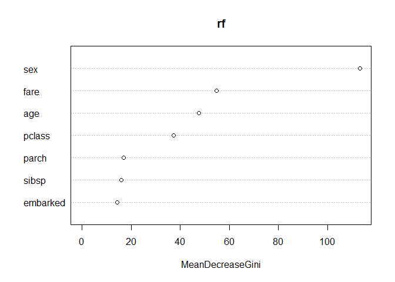

Random Forest
================

``` r
path <-
'https://raw.githubusercontent.com/guru99-edu/R-Programming/master/titanic_data.csv'
```

``` r
titanic <-read.csv(path)
```

``` r
str(titanic)
```

    ## 'data.frame':    1309 obs. of  13 variables:
    ##  $ x        : int  1 2 3 4 5 6 7 8 9 10 ...
    ##  $ pclass   : int  1 1 1 1 1 1 1 1 1 1 ...
    ##  $ survived : int  1 1 0 0 0 1 1 0 1 0 ...
    ##  $ name     : Factor w/ 1307 levels "Abbing, Mr. Anthony",..: 22 24 25 26 27 31 46 47 51 55 ...
    ##  $ sex      : Factor w/ 2 levels "female","male": 1 2 1 2 1 2 1 2 1 2 ...
    ##  $ age      : Factor w/ 99 levels "?","0.1667","0.3333",..: 39 8 23 41 33 67 86 55 73 94 ...
    ##  $ sibsp    : int  0 1 1 1 1 0 1 0 2 0 ...
    ##  $ parch    : int  0 2 2 2 2 0 0 0 0 0 ...
    ##  $ ticket   : Factor w/ 929 levels "110152","110413",..: 188 50 50 50 50 125 93 16 77 826 ...
    ##  $ fare     : Factor w/ 282 levels "?","0","10.1708",..: 79 58 58 58 58 103 236 2 157 153 ...
    ##  $ cabin    : Factor w/ 187 levels "?","A10","A11",..: 45 81 81 81 81 151 147 17 63 1 ...
    ##  $ embarked : Factor w/ 4 levels "?","C","Q","S": 4 4 4 4 4 4 4 4 4 2 ...
    ##  $ home.dest: Factor w/ 370 levels "?","?Havana, Cuba",..: 310 232 232 232 232 238 163 25 23 230 ...

``` r
titanic <- titanic[, -c(1,4,9,11,13)]
```

``` r
titanic$pclass[titanic$pclass==1]="Upper"
titanic$pclass[titanic$pclass==2]="Middle"
titanic$pclass[titanic$pclass==3]="Lower"
```

``` r
titanic$survived[titanic$survived==0]="No"
titanic$survived[titanic$survived==1]="Yes"
```

``` r
titanic$age <- as.numeric(titanic$age)
titanic$fare <- as.numeric(titanic$fare)
```

``` r
titanic$survived <- as.factor(titanic$survived)
titanic$pclass <- as.factor(titanic$pclass)
str(titanic)
```

    ## 'data.frame':    1309 obs. of  8 variables:
    ##  $ pclass  : Factor w/ 3 levels "Lower","Middle",..: 3 3 3 3 3 3 3 3 3 3 ...
    ##  $ survived: Factor w/ 2 levels "No","Yes": 2 2 1 1 1 2 2 1 2 1 ...
    ##  $ sex     : Factor w/ 2 levels "female","male": 1 2 1 2 1 2 1 2 1 2 ...
    ##  $ age     : num  39 8 23 41 33 67 86 55 73 94 ...
    ##  $ sibsp   : int  0 1 1 1 1 0 1 0 2 0 ...
    ##  $ parch   : int  0 2 2 2 2 0 0 0 0 0 ...
    ##  $ fare    : num  79 58 58 58 58 103 236 2 157 153 ...
    ##  $ embarked: Factor w/ 4 levels "?","C","Q","S": 4 4 4 4 4 4 4 4 4 2 ...

``` r
length(which(titanic$embarked=="?"))
```

    ## [1] 2

``` r
titanic <- titanic[!(titanic$embarked=="?"),]
```

``` r
library(MASS)
library(randomForest)
```

    ## randomForest 4.6-14

    ## Type rfNews() to see new features/changes/bug fixes.

``` r
library(caret)
```

    ## Loading required package: lattice

    ## Loading required package: ggplot2

    ## 
    ## Attaching package: 'ggplot2'

    ## The following object is masked from 'package:randomForest':
    ## 
    ##     margin

``` r
smp_size <- floor(0.75*nrow(titanic))
set.seed(42)
train_ind <- sample(seq_len(nrow(titanic)),
                    size=smp_size)

train <- titanic[train_ind, ]
test <- titanic[-train_ind, ]
```

``` r
set.seed(123)
rf = randomForest(survived~., data=train,
                  mtry=floor(sqrt(7)),
                  ntree=500, importance=TRUE)
rf
```

    ## 
    ## Call:
    ##  randomForest(formula = survived ~ ., data = train, mtry = floor(sqrt(7)),      ntree = 500, importance = TRUE) 
    ##                Type of random forest: classification
    ##                      Number of trees: 500
    ## No. of variables tried at each split: 2
    ## 
    ##         OOB estimate of  error rate: 20.41%
    ## Confusion matrix:
    ##      No Yes class.error
    ## No  560  62  0.09967846
    ## Yes 138 220  0.38547486

``` r
test_x = test[c("pclass","sex","age","sibsp",
                "parch","fare","embarked")]
test_y = test$survived
y_pred = predict(rf, test_x)
confusionMatrix(y_pred, test_y)
```

    ## Confusion Matrix and Statistics
    ## 
    ##           Reference
    ## Prediction  No Yes
    ##        No  169  55
    ##        Yes  18  85
    ##                                           
    ##                Accuracy : 0.7768          
    ##                  95% CI : (0.7277, 0.8207)
    ##     No Information Rate : 0.5719          
    ##     P-Value [Acc > NIR] : 6.235e-15       
    ##                                           
    ##                   Kappa : 0.5284          
    ##                                           
    ##  Mcnemar's Test P-Value : 2.515e-05       
    ##                                           
    ##             Sensitivity : 0.9037          
    ##             Specificity : 0.6071          
    ##          Pos Pred Value : 0.7545          
    ##          Neg Pred Value : 0.8252          
    ##              Prevalence : 0.5719          
    ##          Detection Rate : 0.5168          
    ##    Detection Prevalence : 0.6850          
    ##       Balanced Accuracy : 0.7554          
    ##                                           
    ##        'Positive' Class : No              
    ## 

정확도 0.7768 로 tree model 의 0.7523 보다 개선됨

``` r
importance(rf)
```

    ##                 No       Yes MeanDecreaseAccuracy MeanDecreaseGini
    ## pclass   23.317128 30.719073             40.06660         37.37127
    ## sex      70.116114 91.729867             96.13588        113.36347
    ## age       4.091392 10.239746             10.24579         47.73589
    ## sibsp    12.571659  3.355143             13.91605         15.87357
    ## parch    19.959411  7.547062             22.44819         16.85668
    ## fare      9.706252 10.697581             15.39396         54.81606
    ## embarked 12.565074 10.017639             17.66761         14.29369

``` r
varImp(rf)
```

    ##                 No       Yes
    ## pclass   27.018101 27.018101
    ## sex      80.922991 80.922991
    ## age       7.165569  7.165569
    ## sibsp     7.963401  7.963401
    ## parch    13.753236 13.753236
    ## fare     10.201917 10.201917
    ## embarked 11.291357 11.291357

``` r
varImpPlot(rf, type=2)
```


