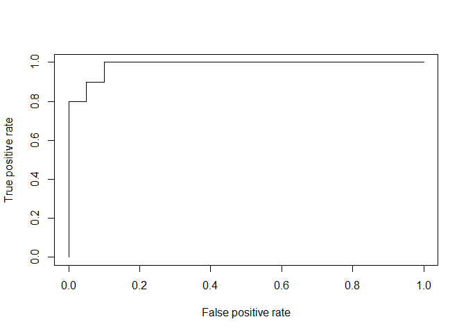

Neural Network
================

``` r
data = read.csv("C:/Users/Choi Sung Wook/Desktop/dividend.csv", header=T)
head(data)
```

    ##   dividend fcfps earnings_growth   de mcap current_ratio
    ## 1        0  2.75          -19.25 1.11  545     0.9240557
    ## 2        1  4.96            0.83 1.09  630     1.4685722
    ## 3        1  2.78            1.09 0.19  562     1.9758751
    ## 4        0  0.43           12.97 1.70  388     1.9419977
    ## 5        1  2.94            2.44 1.83  684     2.4874670
    ## 6        1  3.90           -6.29 0.46  621     1.7832525

``` r
MinMax <- function(x){
  return((x- min(x)) /(max(x)-min(x)))}

X = as.data.frame(lapply(data[,2:6], MinMax))
y = data$dividend
df = cbind(X,y)
str(df)
```

    ## 'data.frame':    200 obs. of  6 variables:
    ##  $ fcfps          : num  0.544 0.992 0.55 0.073 0.582 ...
    ##  $ earnings_growth: num  0 0.338 0.343 0.543 0.365 ...
    ##  $ de             : num  0.2672 0.2621 0.0331 0.4173 0.4504 ...
    ##  $ mcap           : num  0.635 0.757 0.659 0.409 0.835 ...
    ##  $ current_ratio  : num  0.318 0.505 0.68 0.668 0.856 ...
    ##  $ y              : int  0 1 1 0 1 1 1 0 1 1 ...

``` r
samp <- sample(1:200, 160, FALSE)
train <- df[c(samp),]
test <- df[-c(samp),]
str(test)
```

    ## 'data.frame':    40 obs. of  6 variables:
    ##  $ fcfps          : num  0.493 0.89 0.544 0.201 0.495 ...
    ##  $ earnings_growth: num  0.524 0.72 0.665 0.737 0.258 ...
    ##  $ de             : num  0.786 0.832 0.903 0.453 0.517 ...
    ##  $ mcap           : num  0.7974 0.3261 0.0345 0.0718 0.3434 ...
    ##  $ current_ratio  : num  0.663 0.9683 0.0443 0.6349 0.4921 ...
    ##  $ y              : int  1 1 0 0 0 0 1 0 0 1 ...

``` r
library(neuralnet)
nn <- neuralnet(y~., train,
                linear.output=FALSE,
                hidden=c(3,2))
plot(nn)
```

``` r
nn.results <- compute(nn, test[,1:5])
result <- data.frame(actual = test$y,
                     prediction = nn.results$net.result)
head(result)
```

    ##    actual   prediction
    ## 9       1 1.000000e+00
    ## 10      1 9.999874e-01
    ## 11      0 8.531620e-31
    ## 14      0 1.823011e-27
    ## 20      0 1.309785e-07
    ## 26      0 4.675901e-01

``` r
library(caret)
```

    ## Loading required package: lattice

    ## Loading required package: ggplot2

``` r
confusionMatrix(factor(test$y), factor(result$actual))
```

    ## Confusion Matrix and Statistics
    ## 
    ##           Reference
    ## Prediction  0  1
    ##          0 20  0
    ##          1  0 20
    ##                                      
    ##                Accuracy : 1          
    ##                  95% CI : (0.9119, 1)
    ##     No Information Rate : 0.5        
    ##     P-Value [Acc > NIR] : 9.095e-13  
    ##                                      
    ##                   Kappa : 1          
    ##                                      
    ##  Mcnemar's Test P-Value : NA         
    ##                                      
    ##             Sensitivity : 1.0        
    ##             Specificity : 1.0        
    ##          Pos Pred Value : 1.0        
    ##          Neg Pred Value : 1.0        
    ##              Prevalence : 0.5        
    ##          Detection Rate : 0.5        
    ##    Detection Prevalence : 0.5        
    ##       Balanced Accuracy : 1.0        
    ##                                      
    ##        'Positive' Class : 0          
    ## 

``` r
library(ROCR)
```

    ## Loading required package: gplots

    ## 
    ## Attaching package: 'gplots'

    ## The following object is masked from 'package:stats':
    ## 
    ##     lowess

    ## 
    ## Attaching package: 'ROCR'

    ## The following object is masked from 'package:neuralnet':
    ## 
    ##     prediction

``` r
nn.pred <- prediction(nn.results$net.result, test$y)
pref <- performance(nn.pred, "tpr", "fpr")
plot(pref)
```



``` r
nn2 <- neuralnet(y~., train,
                 linear.output=FALSE,
                 hidden=c(30))
nn.results2 <- compute(nn2, test[,1:5])
result2 <- data.frame(actual = test$y,
                      prediction = nn.results2$net.result)
head(result2)
```

    ##    actual   prediction
    ## 9       1 9.999999e-01
    ## 10      1 9.955586e-01
    ## 11      0 3.114638e-16
    ## 14      0 1.687971e-09
    ## 20      0 1.188044e-03
    ## 26      0 1.141043e-04

``` r
confusionMatrix(factor(test$y), factor(result2$actual))
```

    ## Confusion Matrix and Statistics
    ## 
    ##           Reference
    ## Prediction  0  1
    ##          0 20  0
    ##          1  0 20
    ##                                      
    ##                Accuracy : 1          
    ##                  95% CI : (0.9119, 1)
    ##     No Information Rate : 0.5        
    ##     P-Value [Acc > NIR] : 9.095e-13  
    ##                                      
    ##                   Kappa : 1          
    ##                                      
    ##  Mcnemar's Test P-Value : NA         
    ##                                      
    ##             Sensitivity : 1.0        
    ##             Specificity : 1.0        
    ##          Pos Pred Value : 1.0        
    ##          Neg Pred Value : 1.0        
    ##              Prevalence : 0.5        
    ##          Detection Rate : 0.5        
    ##    Detection Prevalence : 0.5        
    ##       Balanced Accuracy : 1.0        
    ##                                      
    ##        'Positive' Class : 0          
    ##
