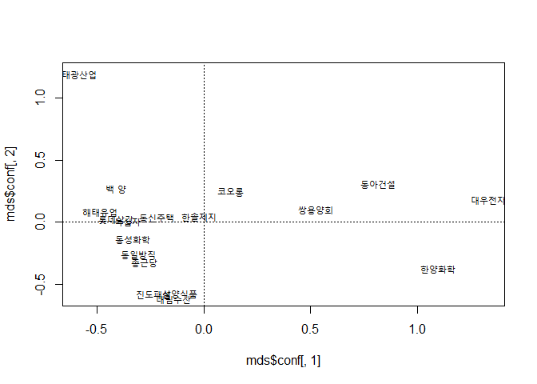
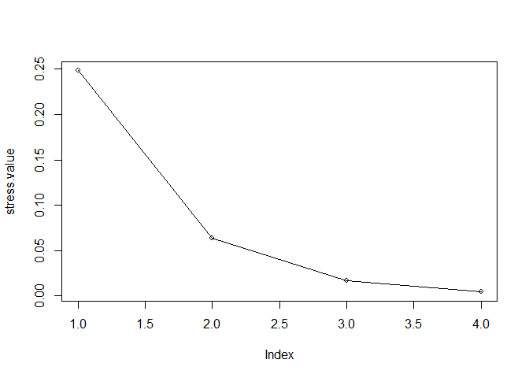
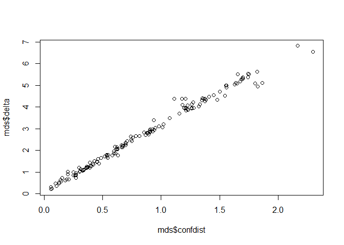

MDS
================

``` r
df = read.csv("data.csv", header=TRUE)
head(df)
```

    ##    company  X1   X2   X3   X4   X5
    ## 1 롯데삼강  90  475  9.3 1010 1641
    ## 2 해태유업 200  132  4.4 1094 1433
    ## 3 대림수산 256  239 39.5 1578 1810
    ## 4 삼양식품 150  352 38.2 2604 2412
    ## 5    백 양 150 1240  3.6 1543 3233
    ## 6 동일방직 150  506 22.9 1438 1079

``` r
X = df[,-1]
head(X)
```

    ##    X1   X2   X3   X4   X5
    ## 1  90  475  9.3 1010 1641
    ## 2 200  132  4.4 1094 1433
    ## 3 256  239 39.5 1578 1810
    ## 4 150  352 38.2 2604 2412
    ## 5 150 1240  3.6 1543 3233
    ## 6 150  506 22.9 1438 1079

``` r
Z = scale(X, center=TRUE, scale=TRUE)
head(Z)
```

    ##              X1         X2         X3         X4         X5
    ## [1,] -0.6396972 -0.1351121 -0.7932559 -0.7143178 -0.5882081
    ## [2,] -0.5993030 -0.4343167 -1.1658074 -0.7049607 -0.6258020
    ## [3,] -0.5787387 -0.3409788  1.5028778 -0.6510462 -0.5576630
    ## [4,] -0.6176640 -0.2424071  1.4040376 -0.5367564 -0.4488576
    ## [5,] -0.6176640  0.5322100 -1.2266322 -0.6549450 -0.3004701
    ## [6,] -0.6176640 -0.1080703  0.2407646 -0.6666413 -0.6897839

&lt;0-1 scaling&gt; maxX = apply(X, 2, max) minX = apply(X, 2, min) z01x = scale(X, center=minX, scale=maxX-minX)

``` r
Z.dist = dist(Z, method="euclidean")
Z.dist = as.matrix(Z.dist)
colnames(Z.dist) = df$company
rownames(Z.dist) = df$company
print(Z.dist)
```

    ##           롯데삼강  해태유업  대림수산  삼양식품     백 양  동일방직
    ## 롯데삼강 0.0000000 0.4810931 2.3072199 2.2115703 0.8484913 1.0406756
    ## 해태유업 0.4810931 0.0000000 2.6718094 2.5886043 1.0230117 1.4459532
    ## 대림수산 2.3072199 2.6718094 0.0000000 0.2142469 2.8775618 1.2908875
    ## 삼양식품 2.2115703 2.5886043 0.2142469 0.0000000 2.7488984 1.2025665
    ## 백 양    0.8484913 1.0230117 2.8775618 2.7488984 0.0000000 1.6476996
    ## 동일방직 1.0406756 1.4459532 1.2908875 1.2025665 1.6476996 0.0000000
    ## 코오롱   1.7727523 1.7796732 2.9737811 2.8356171 1.7637781 2.1515028
    ## 태광산업 4.1090771 4.3773235 5.1078836 4.9590059 3.4065358 4.3328678
    ## 진도패션 2.0916640 2.4393557 0.3616187 0.4715499 2.7183406 1.0839418
    ## 한솔제지 1.2198762 1.4010648 2.2181466 2.0619306 1.4575168 1.3530550
    ## 한양화학 4.9102069 5.0826755 4.1341004 4.0782490 5.1080639 4.4741808
    ## 동성화학 0.6306127 0.9551589 1.7328193 1.6583980 1.3880639 0.5353671
    ## 종근당   1.2442387 1.6184073 1.0797066 1.0108079 1.8800258 0.2448240
    ## 녹십자   0.3091224 0.7509362 2.1528685 2.0478013 0.8490425 0.8765575
    ## 쌍용양회 2.9496213 3.0625613 3.1264009 2.9801306 3.0362572 2.8597887
    ## 대우전자 5.5121063 5.6309492 5.1760995 5.0556129 5.5286510 5.3102302
    ## 동아건설 3.9527938 4.0373110 4.1288576 3.9734439 3.9149865 3.9336372
    ## 동신주택 0.6592676 0.7438557 2.2488539 2.1559255 1.2088913 1.1363687
    ##            코오롱 태광산업  진도패션  한솔제지 한양화학  동성화학
    ## 롯데삼강 1.772752 4.109077 2.0916640 1.2198762 4.910207 0.6306127
    ## 해태유업 1.779673 4.377323 2.4393557 1.4010648 5.082676 0.9551589
    ## 대림수산 2.973781 5.107884 0.3616187 2.2181466 4.134100 1.7328193
    ## 삼양식품 2.835617 4.959006 0.4715499 2.0619306 4.078249 1.6583980
    ## 백 양    1.763778 3.406536 2.7183406 1.4575168 5.108064 1.3880639
    ## 동일방직 2.151503 4.332868 1.0839418 1.3530550 4.474181 0.5353671
    ## 코오롱   0.000000 4.381388 2.9231050 1.0054040 3.695752 1.8716830
    ## 태광산업 4.381388 0.000000 5.0804727 4.2198169 6.548328 4.4186867
    ## 진도패션 2.923105 5.080473 0.0000000 2.1541943 4.316211 1.5027857
    ## 한솔제지 1.005404 4.219817 2.1541943 0.0000000 3.955638 1.1908812
    ## 한양화학 3.695752 6.548328 4.3162111 3.9556376 0.000000 4.5555293
    ## 동성화학 1.871683 4.418687 1.5027857 1.1908812 4.555529 0.0000000
    ## 종근당   2.252460 4.530477 0.8586192 1.4666911 4.378893 0.6737747
    ## 녹십자   1.721038 3.938406 1.9538356 1.1102593 4.724617 0.5653518
    ## 쌍용양회 1.505388 4.996386 3.2183381 1.7892331 2.512181 2.8045212
    ## 대우전자 3.960512 6.820704 5.3815039 4.3872310 2.168675 5.3260029
    ## 동아건설 2.364949 5.519163 4.2670476 2.7996558 2.641088 3.8773468
    ## 동신주택 1.291730 4.379223 2.0642384 0.9040592 4.348599 0.6804953
    ##             종근당    녹십자 쌍용양회 대우전자 동아건설  동신주택
    ## 롯데삼강 1.2442387 0.3091224 2.949621 5.512106 3.952794 0.6592676
    ## 해태유업 1.6184073 0.7509362 3.062561 5.630949 4.037311 0.7438557
    ## 대림수산 1.0797066 2.1528685 3.126401 5.176099 4.128858 2.2488539
    ## 삼양식품 1.0108079 2.0478013 2.980131 5.055613 3.973444 2.1559255
    ## 백 양    1.8800258 0.8490425 3.036257 5.528651 3.914986 1.2088913
    ## 동일방직 0.2448240 0.8765575 2.859789 5.310230 3.933637 1.1363687
    ## 코오롱   2.2524604 1.7210376 1.505388 3.960512 2.364949 1.2917302
    ## 태광산업 4.5304774 3.9384064 4.996386 6.820704 5.519163 4.3792226
    ## 진도패션 0.8586192 1.9538356 3.218338 5.381504 4.267048 2.0642384
    ## 한솔제지 1.4666911 1.1102593 1.789233 4.387231 2.799656 0.9040592
    ## 한양화학 4.3788933 4.7246170 2.512181 2.168675 2.641088 4.3485986
    ## 동성화학 0.6737747 0.5653518 2.804521 5.326003 3.877347 0.6804953
    ## 종근당   0.0000000 1.0963687 2.869113 5.273069 3.950342 1.2655316
    ## 녹십자   1.0963687 0.0000000 2.815450 5.380298 3.846457 0.6539093
    ## 쌍용양회 2.8691128 2.8154495 0.000000 2.666998 1.198857 2.4409627
    ## 대우전자 5.2730691 5.3802977 2.666998 0.000000 1.794494 5.0020271
    ## 동아건설 3.9503415 3.8464565 1.198857 1.794494 0.000000 3.4876071
    ## 동신주택 1.2655316 0.6539093 2.440963 5.002027 3.487607 0.0000000

``` r
library(smacof)
```

    ## Loading required package: plotrix

    ## Registered S3 methods overwritten by 'car':
    ##   method                          from
    ##   influence.merMod                lme4
    ##   cooks.distance.influence.merMod lme4
    ##   dfbeta.influence.merMod         lme4
    ##   dfbetas.influence.merMod        lme4

    ## 
    ## Attaching package: 'smacof'

    ## The following object is masked from 'package:base':
    ## 
    ##     transform

``` r
mds = smacofSym(Z.dist, ndim=2)
names(mds)
```

    ##  [1] "delta"     "dhat"      "confdist"  "iord"      "conf"     
    ##  [6] "stress"    "spp"       "ndim"      "weightmat" "resmat"   
    ## [11] "rss"       "init"      "model"     "niter"     "nobj"     
    ## [16] "type"      "call"

``` r
library(ggplot2)
theme_set(theme_gray(base_family="NanumGothic"))
par(family="NanumGothic")
```

``` r
plot(mds$conf[,1], mds$conf[,2], type="n")
text(mds$conf[,1], mds$conf[,2], rownames(Z.dist), cex=0.9)
abline(h=0, v=0, lty=3)
```



``` r
mds$stress
```

    ## [1] 0.06321835

Stress값= 6.3% 로, 2차원 MDS 적용 결과 개체들 간 관계가 잘 표현되고 있다고 볼 수 있다.

수권자본금(X1), 최고주가(X2), 최저PER(X3), 자산총계(X4), 총매출액(X5) 등 총 5개의 변수들에 대해 2차원으로 축소된 MDS 그래프를 살펴보면,

자본금/자산총계/매출액이 큰 회사(대우전자, 동아건설, 한양화학 등)은 수직선 v=0 을 기준으로 우측에, 작은 회사들은 좌측에 배치되었다. 또한, 최고주가/PER 등이 우량한 회사들 (태광산업, 백양) 은 위쪽에, 최고주가/PER 등이 좋지 않은 회사들 (대림수산, 진도패션, 한양화학) 일수록 상대적으로 아래쪽으로 배치되고 있다.

이로 미루어 볼때, 이 MDS 실행 결과 그래프의 가로축은 회사의 외형 규모 (자본금 / 자산총계 / 매출액) 와 연관성이 크고, 세로축은 회사의 내실(주가, PER) 정도와 관련있다는 해석이 가능하다.

스트레스 적합도 수준
====================

20% 이상 나쁨 (poor) 10 % 보통 (fair) 5% 이내 좋음 (good) 0 % 완벽함 (perfect) --&gt; 스트레스의 크기가 10%이상인 경우에는 표현된 결과가 개체들 간 관계를 잘 표현하고 있다고 할 수 없으므로, 스트레스의 크기가 적정수준이 되도록 차원을 높일 필요가 있음

``` r
mds.1 = smacofSym(Z.dist, ndim=1)
mds.2 = smacofSym(Z.dist, ndim=2)
mds.3 = smacofSym(Z.dist, ndim=3)
mds.4 = smacofSym(Z.dist, ndim=4)
stress.value = c(mds.1$stress, mds.2$stress,
                 mds.3$stress, mds.4$stress)
stress.value
```

    ## [1] 0.248289317 0.063218351 0.016608586 0.004174858

``` r
plot(stress.value, type="l")
points(stress.value, cex=0.9)
```



3차원일 때 stress 는 1.7%로 2차원보다 적합도가 증가하나, 획기적인 차이로 판단되지는 않고, 3차원의 경우 그래프 시각화에 있어 2차원보다 어렵기 때문에 2차원 MDS도 데이터 파악에 좋다.

``` r
plot(mds$confdist, mds$delta)
```



적합도 진단 대부분의 관측점들이 45도 선상에 있다. 개체들이 2차원 공간상에 잘 표현됨.
